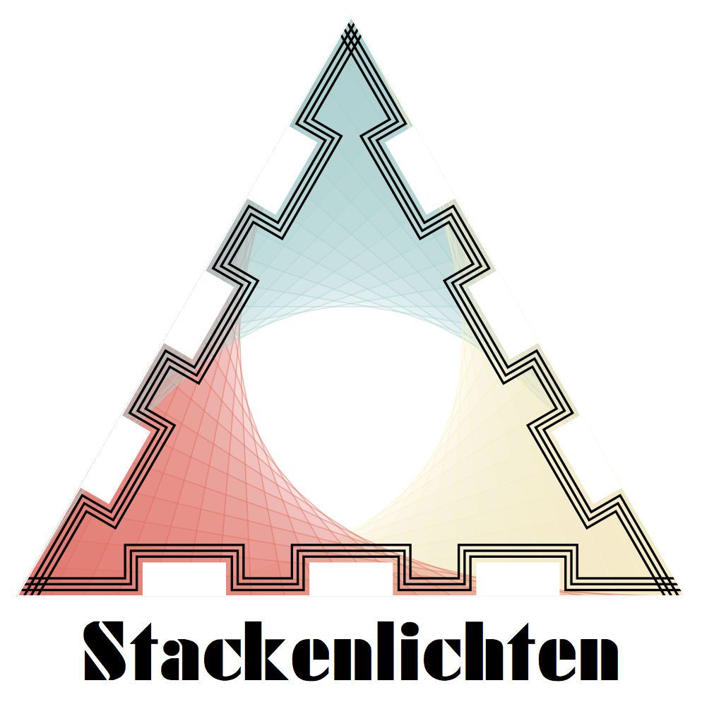
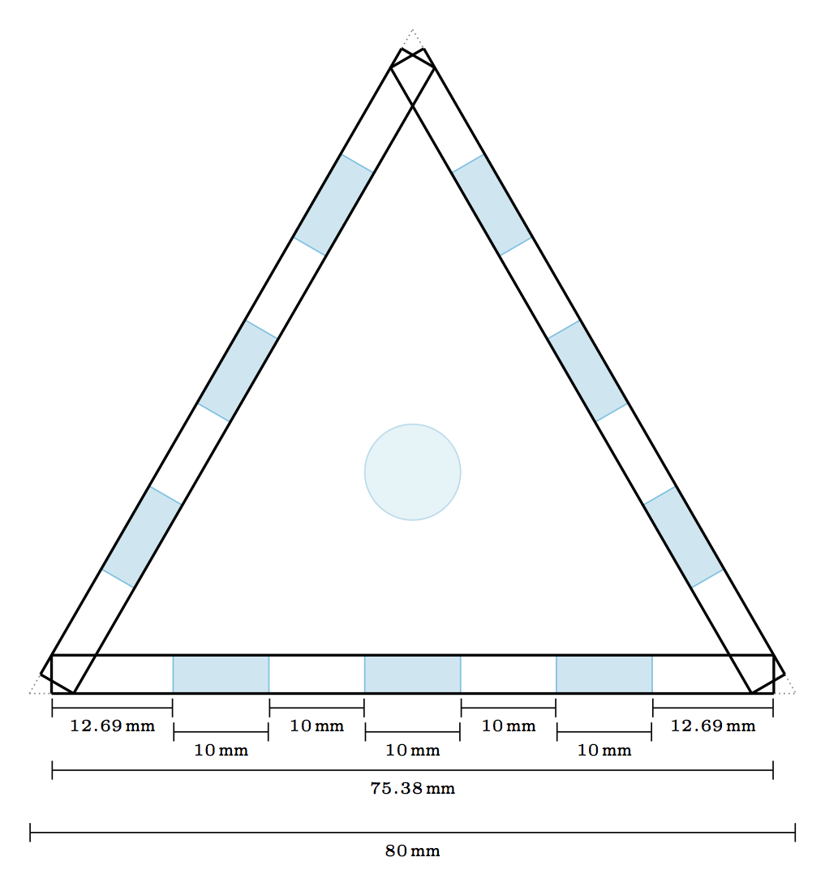
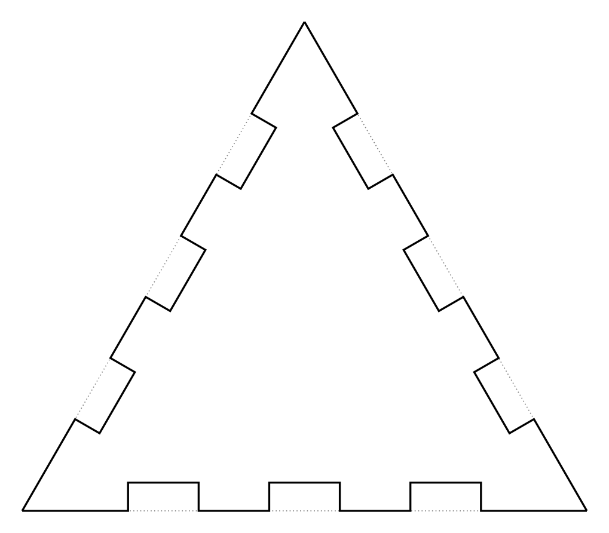
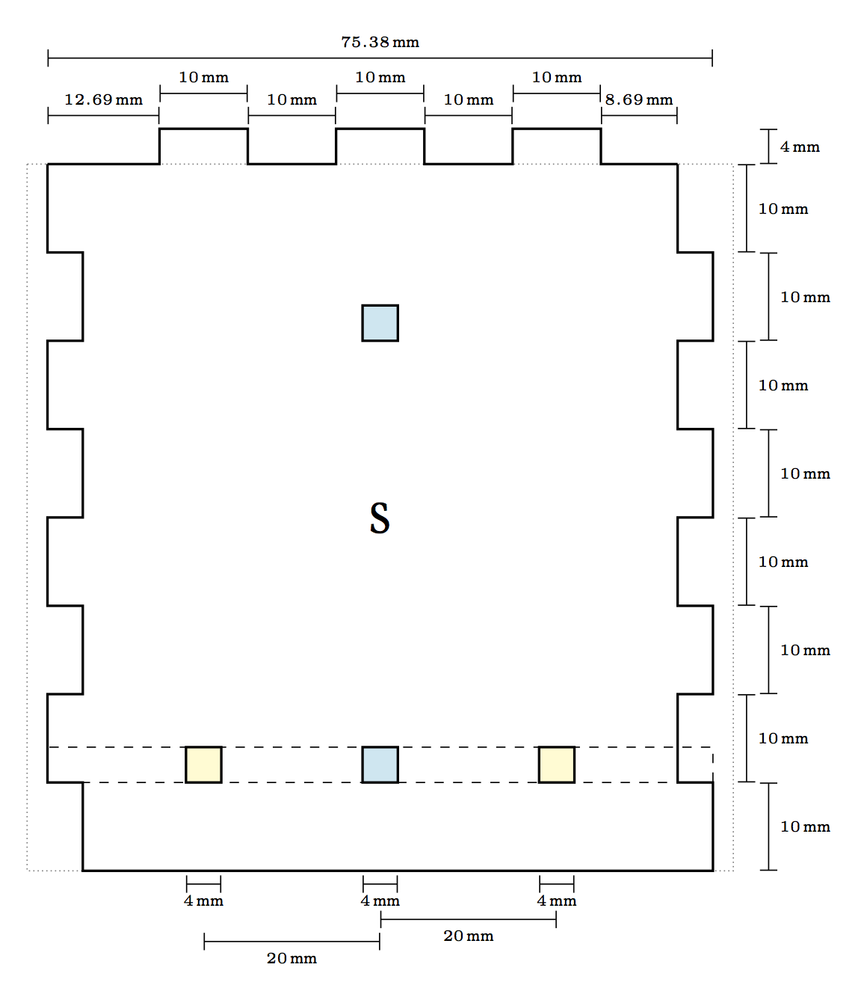
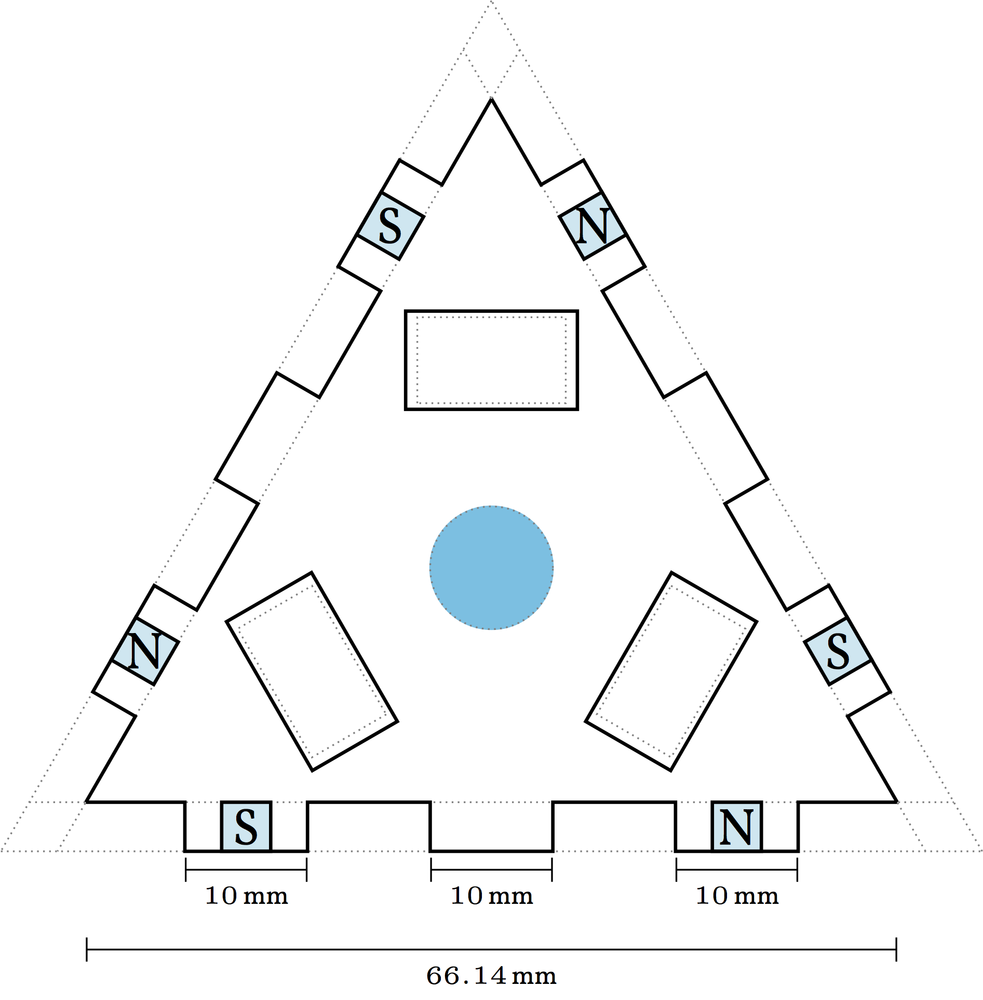

# Stackenlichten

by [@kellertuer](https://twitter.com/kellertuer), [@k4sp4r](https://twitter.com/k4sp4r)

## Motivation
The idea of this project is to provide a blueprint for single pixels, that
can be connected via magnets. The data and power supply works via connectors.
The pixels themselves are equilateral triangles, that can easier be used to
stack different forms of Lichten.

## Material
For building one of the pixels the following is required
* 6 [Neodyn magnets](http://www.magnetportal.de/wuerfel/neodym-magnet-wuerfel-n45-4mm-1-3kg/a-64/) of size `4x4x4 mm` (0,10 € from 200 pieces on)
* 1 [Cables for 3 pin](https://www.adafruit.com/products/1663) (1,50 € each) or [the not black cable version](https://www.amazon.com/HKBAYI-50Pair-50sets-Connector-WS2812B/dp/B00NBSH4CA/ref=sr_1_4?s=electronics&ie=UTF8&qid=1491030077&sr=1-4&keywords=JST+SM+3+pin) (0,24 € each)
* 1 [NeoPixel](https://www.adafruit.com/products/1559) (1,75 €) or any other WS2812 LED having the classical 4 ports +,-,in,out, e.g. [these](https://www.adafruit.com/products/1461) (0,41 € each)
* 4mm thick wood
* 3mm acryl glass (still looking for smoke gray, [Plexiglas satinice](http://www.plexiglas.de/product/plexiglas/de/produkte/plexiglas-satinice/pages/default.aspx) works, too)
* a laser cutter

## Sketches

Seen from the top, the pixel consists of 3 equal sides. with finger joints of
1cm indicated in cyan (the fingers). The three sides are shortened, such that
the edges don't overlap the triangular shape.

The top plate made of plexi glas obtains a shape, that looks quite fance but is
basically just the triangular shape with the fingers of `0.4x1 cm` cut out.

 Attention: Measurements here are wrong, please use the up to date openSCAD file. I will update the TikZ graphics soon(ish) 
Each side plate is made with equal fingers for the sides, but for each pixel
two sides sould consists of the same pole pointing outward ([S]outh in the sketch)
and one having the other. This yields South dominated or North dominated pixels,
which should be produced in equal amounts.

The bottom plate is placed 1cm inwards of the sides with 2 bolts for each side.
The magnets should join into the sides by 3/4th (`3 mm`) the top one should be
glued, the bottom one should be held by the bottom plate.

## Wires
Using a 3-pole connectors, the fadecandy board can directly be provided with ground by using the ground of the LEDs. On the other hand at the end of each data line the power supply can be directly connected. If there is a need to
power supply in between, two connectors can be used between two pixels, where
the data line is just passed through and hence both pixels are provided with power.

## KuDos
* [Blinkenlichten](http://blinkenlights.net)
* [Stackenblochen](https://www.youtube.com/watch?v=QEN5-_93gQg)
* inKL for all 3D printing help
* @k4spar for a lot of laz0r
* Haruto end eBrnd as well as FabLab KA for even more laz0r
