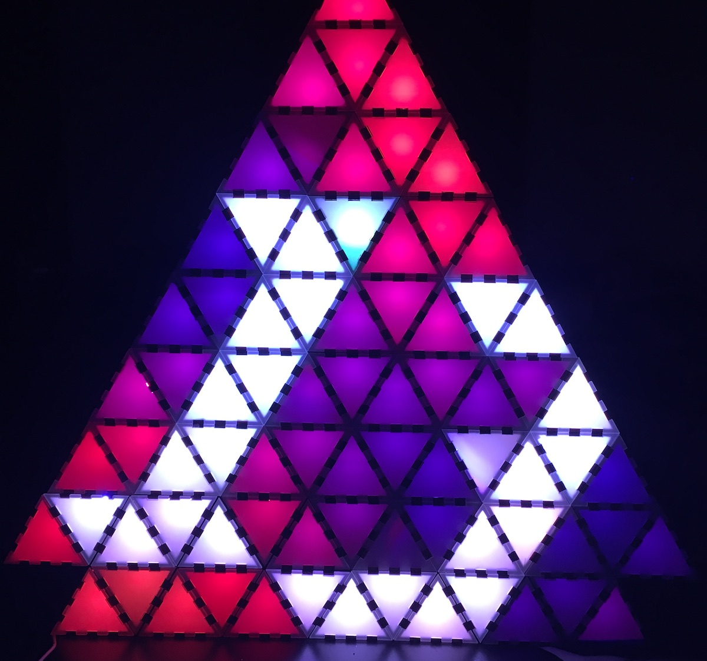

# Stackenlichten

by <a href="https://twitter.com/kellertuer">@kellertuer</a>, <a href="https://twitter.com/k4sp4r">@k4spar</a>.

## Motivation
The idea of this project is to provide a blueprint for single pixels, that
can be connected via magnets. The data and power supply works via connectors.
The pixels themselves are equilateral triangles, that can easier be used to
stack different forms of Lichten.

## Code
Based on the fadecandy chip and its accompanying python code, I work on several methods to perform artistic lights and games on such trixel sets.

## Build your own
In order to build your own Trixels, see [Manual.md](manual/manual.md).

## KuDos
* [Blinkenlichten](http://blinkenlights.net)
* [Stackenblochen](https://www.youtube.com/watch?v=QEN5-_93gQg)
* [inKL](http://chaos-inkl.de) for all 3D printing help
* [@k4spar](http://twitter.com/k4spar) for a lot of laz0r wood and discussions in the begginnig of the trixel idea at the [33c3](https://events.ccc.de/congress/2016/wiki/Main_Page).
* Haruto end eBrnd as well as [FabLab KA](https://fablab-karlsruhe.de) for even more laz0r
